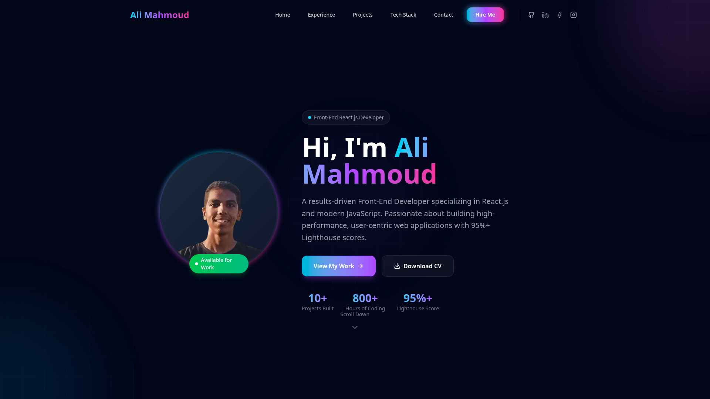

<div align="center">

# 🚀 Ali Mahmoud | Portfolio

**Front-End React Developer — Egypt**

A modern, high-performance portfolio website built with cutting-edge web technologies. Designed with a sleek dark theme, smooth animations, and optimized for SEO with 95%+ Lighthouse scores.

[🌐 Live Demo](https://alimahmoud-dev.vercel.app) &nbsp;|&nbsp; [📧 Contact Me](mailto:123aliactionx5@gmail.com) &nbsp;|&nbsp; [💼 LinkedIn](https://www.linkedin.com/in/ali-mahmoud-34923b3a6)



</div>

---

## 🎯 About This Project

This is my personal portfolio website — a single-page application that showcases my skills, projects, experience, and tech stack. The site is built with performance and SEO as top priorities, utilizing Next.js Server Components for optimal loading speed and search engine crawlability. Every section is designed to leave a strong impression on potential employers and clients, featuring smooth Framer Motion animations, a fully responsive layout, and a modern dark theme with gradient accents that reflect my design sensibility as a front-end developer.

The architecture follows best practices for scalability and maintainability, with lazy-loaded below-the-fold components, proper heading hierarchy for accessibility, and comprehensive structured data that helps search engines understand and rank the content effectively.

## 🛠️ Tech Stack

| Category | Technologies |
|----------|-------------|
| **Framework** | Next.js 16 (App Router, Server Components) |
| **Language** | TypeScript |
| **Styling** | Tailwind CSS 4 |
| **Animations** | Framer Motion |
| **Icons** | Lucide React |
| **Contact** | EmailJS |
| **Deployment** | Vercel |

## ✨ Features

### Performance
- ⚡ Next.js Server Components for optimal initial load
- 📦 Lazy-loaded below-the-fold sections (Experience, Tech Stack, Contact, Footer)
- 🖼️ Optimized images with lazy loading and proper sizing
- 🎯 95%+ Google Lighthouse scores across all categories

### Design & UX
- 🎨 Sleek dark theme with cyan-purple-pink gradient accents
- 📱 Fully responsive design (mobile, tablet, desktop)
- 🎬 Smooth scroll-triggered animations
- 📊 Interactive project cards with detail modals
- 🔄 Scroll progress indicator bar
- ✨ Hover effects and micro-interactions throughout

### SEO & Accessibility
- 🔍 Comprehensive meta tags (title, description, keywords, canonical)
- 📱 Open Graph & Twitter Card meta tags for social sharing
- 📊 JSON-LD structured data (Person, WebSite, ItemList schemas)
- 🗺️ Auto-generated sitemap.xml
- 🤖 robots.txt configuration
- ♿ Semantic HTML with proper heading hierarchy (h1 → h2 → h3)
- 🏷️ Descriptive alt text for all images
- 🔗 Google Search Console verification

### Architecture
- 🏗️ Server Component for the main page (SEO-friendly)
- 🔌 Client Shell wrapper for interactive features only
- 📂 Clean component-based structure
- 🎯 Type-safe with TypeScript throughout
- 📱 PWA manifest support

## 📂 Project Structure

```
src/
├── app/
│   ├── globals.css          # Global styles, Tailwind config, custom scrollbar
│   ├── layout.tsx           # Root layout with full SEO metadata & JSON-LD
│   ├── page.tsx             # Home page — Server Component
│   ├── manifest.ts          # PWA manifest (theme, icons, display)
│   └── sitemap.ts           # Auto-generated XML sitemap
├── components/portfolio/
│   ├── ClientShell.tsx      # Client wrapper with dynamic imports
│   ├── Navbar.tsx            # Fixed navbar with scroll detection & mobile menu
│   ├── Hero.tsx              # Hero section with profile, stats & CTAs
│   ├── Experience.tsx        # Professional journey timeline
│   ├── ProjectsSection.tsx   # Projects grid with filtering
│   ├── ProjectCard.tsx       # Interactive project card with hover effects
│   ├── ProjectModal.tsx      # Detailed project modal (challenge/solution/lessons)
│   ├── TechStack.tsx         # Categorized technology stack display
│   ├── ContactForm.tsx       # Contact form with EmailJS integration
│   ├── Footer.tsx            # Footer with links & social icons
│   └── ScrollProgress.tsx    # Animated scroll progress bar
└── data/
    └── projectsData.ts       # Projects, social links & tech stack data
```

## 🌐 Live Demo

👉 **[alimahmoud-dev.vercel.app](https://alimahmoud-dev.vercel.app)**

## 📬 Connect With Me

| Platform | Link |
|----------|------|
| **Email** | [123aliactionx5@gmail.com](mailto:123aliactionx5@gmail.com) |
| **GitHub** | [AliMahmoudDev](https://github.com/AliMahmoudDev) |
| **LinkedIn** | [Ali Mahmoud](https://www.linkedin.com/in/ali-mahmoud-34923b3a6) |
| **Facebook** | [Ali Mahmoud](https://www.facebook.com/share/18JK2Mv2c3/) |
| **Instagram** | [@ali_mahmmoud_2](https://www.instagram.com/ali_mahmmoud_2) |
